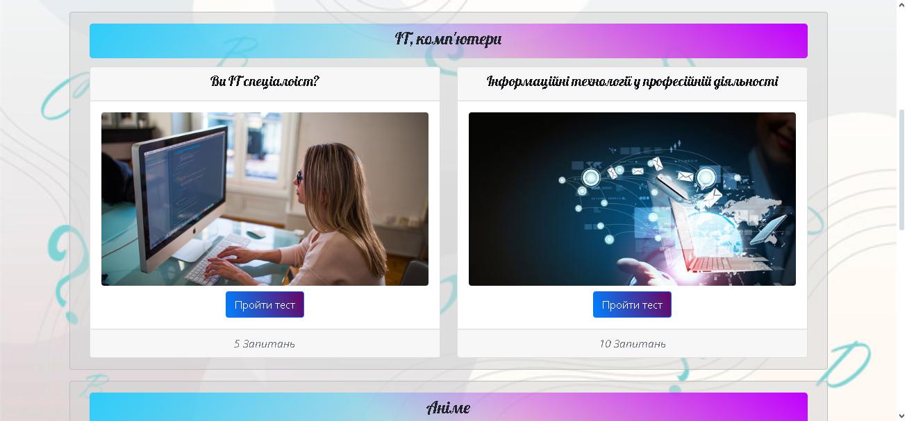

<p align="center"></p>
<h1 align="center">online-victorine</h1>

## Description
<b>EN:</b>

This is a revised version of a course project I was commissioned ([Online-Victorine](https://github.com/CoolOtaku/Online-Victorine)).

A site (game) for passing quizzes on various topics. Using its own **API**.

<b>UA:</b>

Це доопрацьована версія курсового проекту, який у мене замовили ([Online-Victorine](https://github.com/CoolOtaku/Online-Victorine)).

Сайт (гра) для проходження вікторін на різні теми. З використанням власного **API**.

#
## Screenshots
<p>
  
  
  
  
  
  
  
  
</p>

#
## Technologies used
<b>EN:</b>
- Using [**Bootstrap**](https://getbootstrap.com) (front-end framework)
- Using the library [**jQuery**](https://jquery.com)
- Using the library [**SweetAlert2**](https://sweetalert2.github.io)
- Using the ***Cookie*** system
- Creating a **JavaScript** quiz game
- Using a **MySQL** database
- Creating your own **API**
- Authorization through **Google**
- Search for information and navigation on the site

<b>UA:</b>
- Використання [**Bootstrap**](https://getbootstrap.com) (front-end framework)
- Використання бібліотеки [**jQuery**](https://jquery.com)
- Використання бібліотеки [**SweetAlert2**](https://sweetalert2.github.io)
- Використання системи ***Cookie***
- Створення гри-вікторини на **JavaScript**
- Використання бази даних **MySQL**
- Створення власного **API**
- Авторизація через **Google**
- Пошук інформації та навігація по сайту

#
## License
```
© 2022, CoolOtaku (ericspz531@gmail.com)
```
